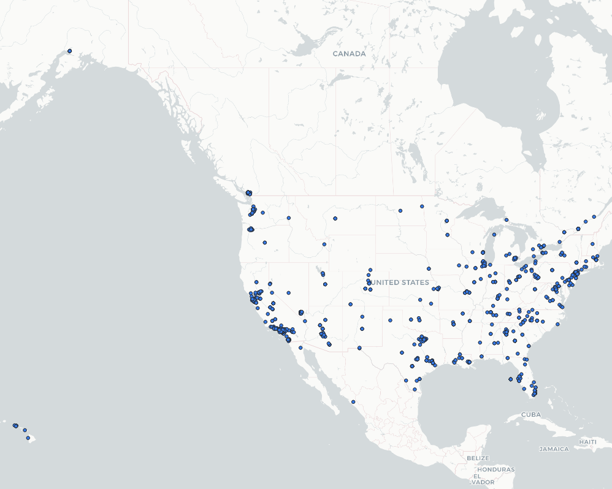
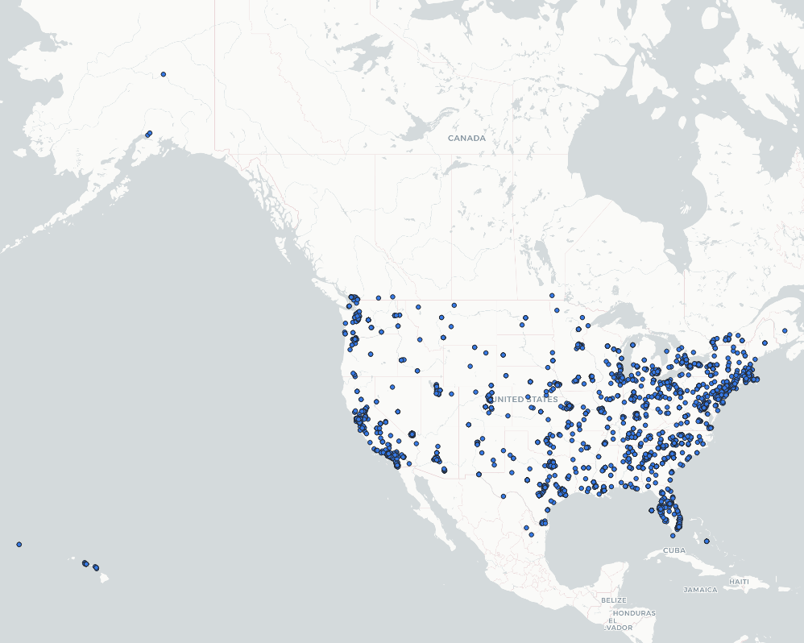
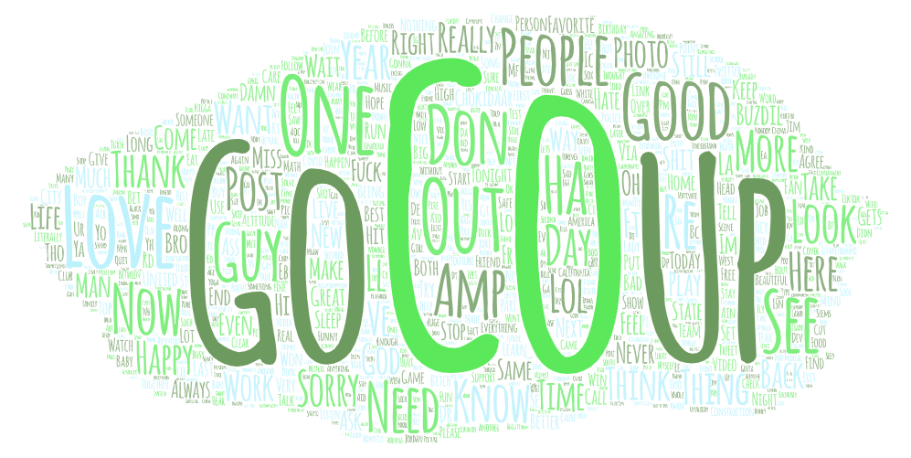
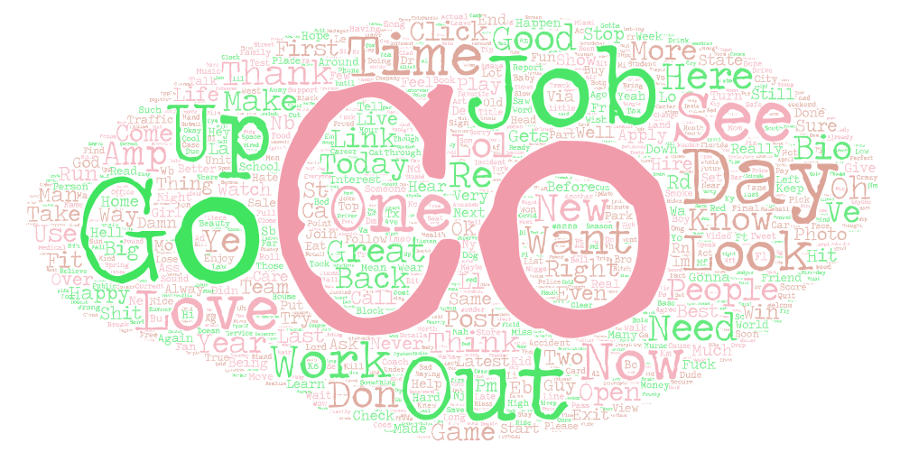

# Lab2: Geo-tagged tweet collection and visualization

## Part 1:  Purpose of this research 
The maps capture the tweets distrubition across the US, and the maps focus on showing the difference between the Twitter usage (number of new tweets created) between two different time perios. Therefore, there were no limitation for the types of tweets contents, but rather focusing on the data collection time periods which was different for the two maps. 

## Part 2: The difference between the maps
The data for the first map (period 1) was retrieved after 10pm PST, whereas the data for the second map (period 2) was retrieved at 2pm PST. Each dot represents one new tweet in the two maps. We can clearly see from the maps that there are less dots in the map 1 then the map 2, which indicates that there are less people posting tweets during period 1. In period 2, there are twice as much new tweets as in period 1. During period one, it was after 10 pm in the west coast, and 2 am in the east coast. It was possible that the majority of the population was sleeping and not using their phones or other devices with acess to Twitter. However, during period 2, it was 2 pm at the west coast and 6 pm at the east coast. People were taking a break from work or school. Most important, most people were not sleeping. Therefore, there were more new tweets during period 2 than period 1.

*Map1: period 1 data retrieved after 10pm PST, less tweets than period 2.*

*Map2: period 2 data retrieved after 2pm PST, more tweets than period 1.*

## Part 3: The difference between the contexts
Since the tweet data collection did not limit the context of the tweets, we can see from the two wordclouds that the first two mostly used contexts were the same, "co" and "go". However, because of the different natures of the two time periods, people tends to post tweets with more emotional context during night time (Word Cloud1), like "sorry", "happy", "miss", and **"sleep"**. On the other hand, during period two which is during day time (Word Cloud2), people are mostly working, thus, the context are mostly related to **"work"**, "job", "time", and "creat". 

*Word Cloud1 for period 1 (10pm PST) tweet context.*

*Word Cloud2 for period 2 (2pm PST) tweet context.*

